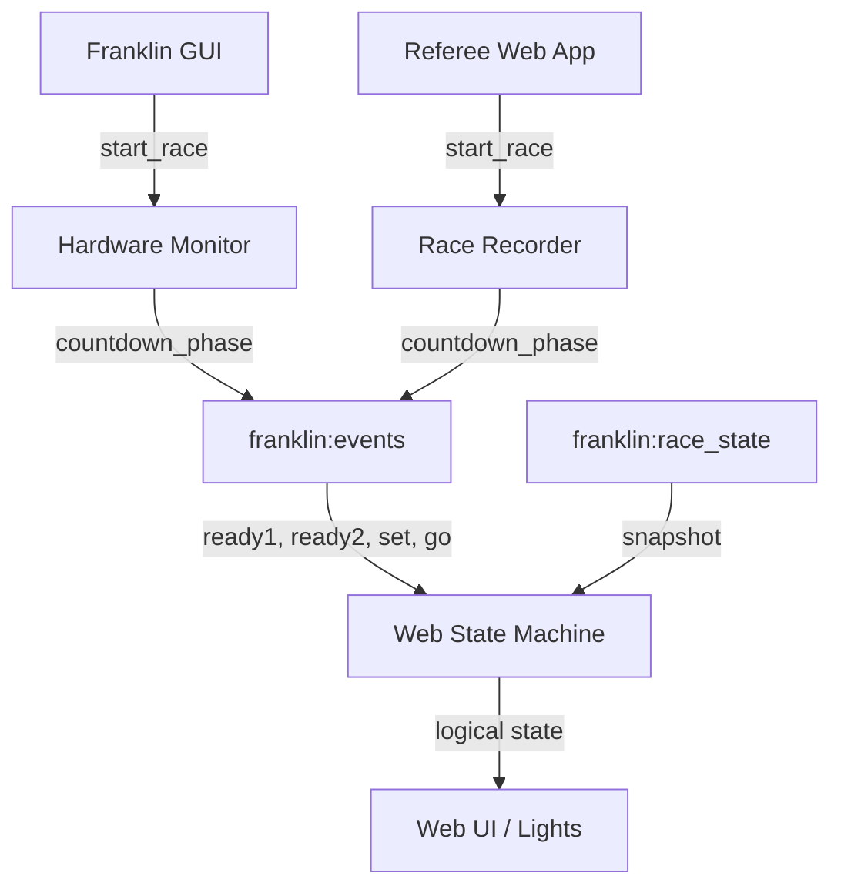

# Requirements

### Overview & Goals
Refactor the race start sequence from 3 lights to 4 lights (2 Red, 1 Yellow, 1 Green) to give racers more time and improve state consistency across all applications. Implement a centralized state machine in the web apps to serve as the "gold standard" for UI and visual indicator behavior.

### Scope
- **Start Sequence**: `ready1` -> `ready2` -> `set` -> `go`.
- **Light Pattern**: 2 Red, 1 Yellow, 1 Green (mirrored/symmetrical filling).
- **Timing**: Increase default countdown intervals (e.g., from 1.0s to 1.5s per phase).
- **Web Apps**: Refactor `Scoreboard`, `Referee`, and `Driver` views to use a shared state machine and 4-light UI.
- **Backend**: Update Rust hardware monitor, Python race recorder, and Python GUI to support the new sequence and fields.

### User Stories
- As a racer, I want a longer countdown with more visual steps so that I can better prepare for the race start.
- As a developer, I want a unified state machine for the web apps so that the UI remains consistent even when messages arrive out of order or snapshots are delayed.

# Technical Design

### Current Implementation
- **Lights**: 3 lights (Red, Yellow, Green) on each side of the GUI timer and in web apps.
- **Phases**: `ready`, `set`, `go`.
- **Timing**: Roughly 1.0s per phase (2.0s total countdown).
- **State Handling**: Logic is duplicated across `referee.html`, `index.html`, and `driver.html`, often reacting directly to individual Redis events.

### Proposed Changes

#### 1. Contract & Backend Updates
- **Redis Contract**: Add `ready1_at` and `ready2_at` to `start_race` command; add `ready1` and `ready2` to `countdown_phase` event.
- **Hardware Monitor (Rust)**:
  - Add fields to `InMessage::Command`.
  - Update `start_race` handler to calculate 4 phases.
  - New default intervals: 1.5s (Total 4.5s countdown).
- **Race Recorder (Python)**: Update `_publish_countdown_phases` and `start_race` command caching for FAKE mode.
- **GUI (Python)**:
  - Increase `_start_light_count` to 4.
  - Update `ready1`/`ready2` handling and 4-light CSS/rendering.

#### 2. Web State Machine (`static/state-machine.js`)
- **State Logic**: Encapsulates `snapshot.state`, `countdown_active`, and `countdown_phase` into a single logical "UI State".
- **States**: `idle`, `ready1`, `ready2`, `set`, `go`, `running`, `paused`, `winner_declared`, `finished`.
- **Derived Properties**: Provides `lightPattern`, `statusText`, and `buttonsEnabled` based on the current state.
- **Consistency**: Handles out-of-order `countdown_phase` events using a monotonic phase order.

#### 3. Web UI Updates
- **HTML**: Update `#lights` and `#start-lights` containers to include 4 light elements.
- **CSS**: Adjust widths and spacing for 4 lights.
- **Refactoring**: Replace localized state handling with calls to the new state machine.

### File Structure
- `docs/redis-message-reference.md`: Updated contracts.
- `static/state-machine.js`: New shared state machine logic.
- `static/index.html`, `static/referee.html`, `static/driver.html`: Updated UI and logic.
- `static/sounds.json`, `static/audio.js`: Updated audio assets and triggers.
- `rust/franklin-hardware-monitor/src/main.rs`: Updated Rust backend.
- `franklin-gui.py`, `franklin-race-recorder.py`, `referee_web_app.py`: Updated Python backend/servers.

### Architecture Diagram

# Testing

### Validation Approach
- **FAKE Race Verification**: Run a FAKE race via the GUI or Referee app and verify the 4-phase countdown (beeps and lights) on all platforms.
- **Timing Check**: Verify the countdown takes ~4.5 seconds from the first "Ready" beep to "Go".
- **State Consistency**: Simulate delayed snapshots or out-of-order events and ensure the UI transitions correctly according to the state machine.
- **Manual Light Check**:
  - `ready1`: 1 Red
  - `ready2`: 2 Red
  - `set`: 2 Red + 1 Yellow
  - `go`: 2 Red + 1 Yellow + 1 Green

### Key Scenarios
1. **Successful Start**: `idle` -> `ready1` -> `ready2` -> `set` -> `go` -> `running`.
2. **Aborted Start**: Hit `Reset` during `ready2` -> should return to `idle` (Red) immediately.
3. **Paused Race**: `running` -> `paused` (all Yellow).
4. **Finished Race**: `winner_declared` -> `finished` (all Off).

# Delivery Steps

### ✓ Step 1: Update shared contracts and sound assets
Update the Redis message reference and sound assets to support the new 4-light sequence.
- Add `ready1_at` and `ready2_at` to the `start_race` command and `ready1`, `ready2` phases to the `countdown_phase` event in `docs/redis-message-reference.md`.
- Add `ready1` and `ready2` sound definitions to `static/sounds.json` (initially mirroring `ready`).
- Update `static/audio.js` to include `playReady1()` and `playReady2()`.

### ✓ Step 2: Refactor Rust hardware monitor start sequence
Modify the Rust hardware monitor to handle the new start sequence and timing.
- Update `InMessage::Command` in `rust/franklin-hardware-monitor/src/main.rs` to include `ready1_at` and `ready2_at`.
- Update the `start_race` command handler to calculate 4 phases (`ready1`, `ready2`, `set`, `go`) with increased default intervals (1.5s each).
- Update the countdown publishing logic to emit all 4 phases.

### ✓ Step 3: Refactor Python race recorder for 4-phase countdown
Update the Python race recorder to support the new sequence in simulation mode.
- Modify `_publish_countdown_phases` in `franklin-race-recorder.py` to handle `ready1`, `ready2`.
- Update the `start_race` command handler to use the new fields and increased timing for FAKE races.

### ✓ Step 4: Update Franklin GUI for 4-light display
Update the GTK GUI to render 4 lights and handle the new phases.
- Increase `_start_light_count` to 4 in `franklin-gui.py`.
- Update `_START_PHASE_ORDER` and `_start_race_countdown` to handle `ready1` and `ready2`.
- Adjust light patterns in `show_phase_local` and the countdown request to match the 2-Red, 1-Yellow, 1-Green pattern with 1.5s intervals.

### ✓ Step 5: Implement web app state machine and update UIs
Implement a unified state machine to manage race states across all web apps.
- Create `static/state-machine.js` containing `FranklinRaceStateMachine` to encapsulate state logic, transitions, and derived UI properties.
- Integrate the state machine into `static/index.html`, `static/referee.html`, and `static/driver.html`.
- Update HTML and CSS in all three web apps to display 4 lights and use the state machine as the source of truth for UI updates.
- Refactor `referee_web_app.py` to request the new 4-phase sequence when starting a race from the web.